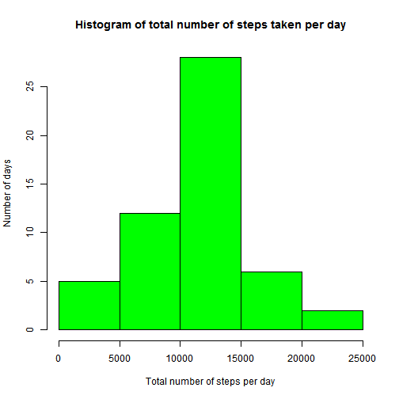
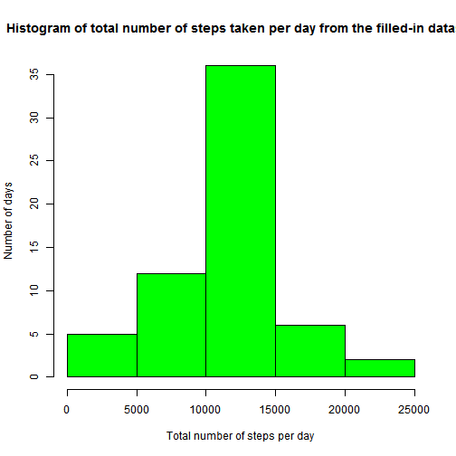

Reproducible Research: Peer Assessment 1
=========================================

### A. Loading and preprocessing the data

Show any code that is needed to  
    &ensp; 1. Load the data (i.e. read.csv())  
    &ensp; 2. Process/transform the data (if necessary) into a format suitable for your analysis


```r
rawdata <- read.csv("activity.csv", header=TRUE, sep=",")
```

### B. What is mean total number of steps taken per day?
For this part of the assignment, you can ignore the missing values in the dataset.  
    &ensp; 1. Calculate the total number of steps taken per day  
    &ensp; 2. If you do not understand the difference between a histogram and a barplot, research the difference between them. Make a histogram of the total number of steps taken each day  
    &ensp; 3. Calculate and report the mean and median of the total number of steps taken per day


```r
# Ignore records with missing value 'NA'
  # If 'NA' should be omitted
data_clean <- na.omit(rawdata)
# Calculate the total number of steps taken per day
StepsPerDay <- aggregate(steps ~ date, data = data_clean, sum)
# Make a histogram of the total number of steps taken each day
hist(StepsPerDay$steps, 
     xlab="Total number of steps per day",
     ylab="Number of days",
     main="Histogram of total number of steps taken per day",
     col="green")
```

 

```r
# Calculate the mean of the total number of steps taken per day
meanSteps <- mean(StepsPerDay$steps)
# Calculate the median of the total number of steps taken per day
medianSteps <- median(StepsPerDay$steps)
# Report the mean and median values
print(sprintf("Mean of total steps: %f; Median of total steps: %i", meanSteps, medianSteps))
```

```
## [1] "Mean of total steps: 10766.188679; Median of total steps: 10765"
```

### C. What is the average daily activity pattern? 
<p>
    &ensp; 1. Make a time series plot (i.e. type = "l") of the 5-minute interval (x-axis) and the average number of steps taken, averaged across all days (y-axis)  


```r
# Calculate the average number of steps in an interval across all days
intervalSteps <- aggregate(steps ~ interval, data = data_clean, mean)

plot(steps ~ interval, data = intervalSteps, type = "l",
     xlab = "5-minute interval",
     ylab = "Average number of steps",
     main= " Average Daily Activity Pattern")
```

 
<p>
    &ensp; 2. Which 5-minute interval, on average across all the days in the dataset, contains the maximum number of steps?

```r
maxAveSteps <- max(intervalSteps$steps)
targetInterval <- intervalSteps$interval[intervalSteps$steps == maxAveSteps]
print(sprintf("Interval '%i' contains the maximum number of steps on average across all the days in the dataset, which is '%f'.", targetInterval, maxAveSteps))
```

```
## [1] "Interval '835' contains the maximum number of steps on average across all the days in the dataset, which is '206.169811'."
```


### D. Imputing missing values
Note that there are a number of days/intervals where there are missing values (coded as NA). The presence of missing days may introduce bias into some calculations or summaries of the data.
<p>
    &ensp; 1. Calculate and report the total number of missing values in the dataset (i.e. the total number of rows with NAs)  

```r
numNA <- sum(is.na(rawdata$steps))
print(sprintf("The total number of missing values in the dataset is '%d'.", numNA))
```

```
## [1] "The total number of missing values in the dataset is '2304'."
```
<p>
    &ensp; 2. Devise a strategy for filling in all of the missing values in the dataset. The strategy does not need to be sophisticated. For example, you could use the mean/median for that day, or the mean for that 5-minute interval, etc. 
<p>
    &ensp; => My strategy is to replace 'NA' with the rounded mean of the 5-minute interval
<p>
    &ensp; 3. Create a new dataset that is equal to the original dataset but with the missing data filled in.

```r
dataComplete <- rawdata;
for (i in 1:nrow(dataComplete)) {
    if (is.na(dataComplete$steps[i])) {
        whichInterval <- dataComplete$interval[i]
        dataComplete$steps[i] <- round(intervalSteps$steps[intervalSteps$interval == whichInterval])
    }
}
# Confirm whether there is 0 number of missing values in the new dataset
numNA2 <- sum(is.na(dataComplete$steps))
print(sprintf("The total number of missing values in the new dataset is '%d'.", numNA2))
```

```
## [1] "The total number of missing values in the new dataset is '0'."
```
<p>
    &ensp; 4. Make a histogram of the total number of steps taken each day and Calculate and report the mean and median total number of steps taken per day. Do these values differ from the estimates from the first part of the assignment? What is the impact of imputing missing data on the estimates of the total daily number of steps?
    

```r
# Calculate the total number of steps taken per day from the new data
StepsPerDay2 <- aggregate(steps ~ date, data=dataComplete, sum)
# Make a histogram of the total number of steps taken each day
hist(StepsPerDay2$steps, 
     xlab="Total number of steps per day",
     ylab="Number of days",
     main="Histogram of total number of steps taken per day from the filled-in dataset",
     col="green")
```

 

```r
# Calculate the mean of the total number of steps taken per day
meanSteps2 <- mean(StepsPerDay2$steps)
# Calculate the median of the total number of steps taken per day
medianSteps2 <- median(StepsPerDay2$steps)

# Report the mean and median values
print(sprintf("NA-removed dataset: Mean of total steps = %f; Median of total steps = %i", meanSteps, medianSteps))
```

```
## [1] "NA-removed dataset: Mean of total steps = 10766.188679; Median of total steps = 10765"
```

```r
print(sprintf("Filled-in dataset: Mean of total steps = %f; Median of total steps = %i", meanSteps2, medianSteps2))
```

```
## [1] "Filled-in dataset: Mean of total steps = 10765.639344; Median of total steps = 10762"
```
<p>
The values are different from the estimates from the first part of the assignment. So, imputing missing data helps to avoid bias due to presence of missing data.


### E. Are there differences in activity patterns between weekdays and weekends?  
For this part the weekdays() function may be of some help here. Use the dataset with the filled-in missing values for this part.  
<p>
    &ensp; 1. Create a new factor variable in the dataset with two levels - "weekday" and "weekend" indicating whether a given date is a weekday or weekend day.  
    

```r
# Convert date format to date class
dataComplete$date <- as.Date(dataComplete$date, "%Y-%m-%d")

# Add a new column 'dayofweek', which indicates day of a week
dataComplete$dayofweek <- weekdays(dataComplete$date)

# Add a new column 'daytype', which indicates 'weekday' or 'weekend'
for (i in 1:nrow(dataComplete)) {
    if (dataComplete$dayofweek[i] == "Saturday" || dataComplete$dayofweek[i] == "Sunday") {
        dataComplete$daytype[i] = "weekend"
    }
    else {
        dataComplete$daytype[i] = "weekday"
    }
}

# Convert daytype from character to factor
dataComplete$daytype <- as.factor(dataComplete$daytype)
```
<p>
    &ensp; 2. Make a panel plot containing a time series plot (i.e. type = "l") of the 5-minute interval (x-axis) and the average number of steps taken, averaged across all weekday days or weekend days (y-axis). See the README file in the GitHub repository to see an example of what this plot should look like using simulated data.  
    

```r
# Calculate the average number of steps in an interval according to daytype across all days
intervalSteps2 <- aggregate(steps ~ interval+daytype, data=dataComplete, mean)

library(lattice)
xyplot(steps ~ interval | factor(daytype), data = intervalSteps2, aspect = 1/2,
    xlab = "5-minute Interval", 
    ylab = "Average number of steps", 
    main = "Average Daily Activity Pattern (weekend vs. weekday)",
    type = "l")
```

 
